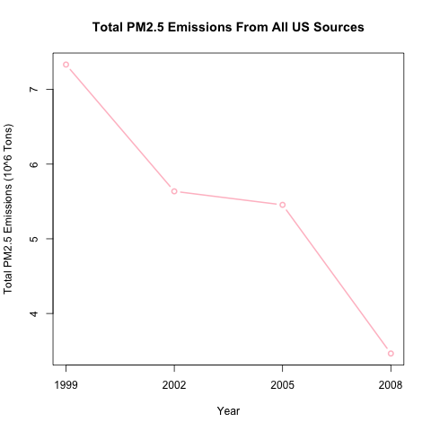
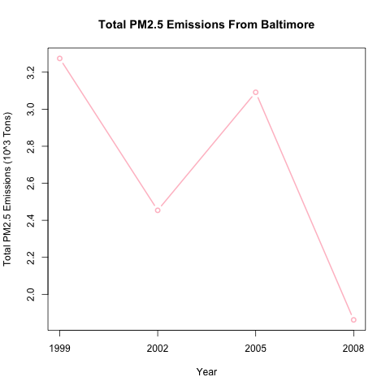
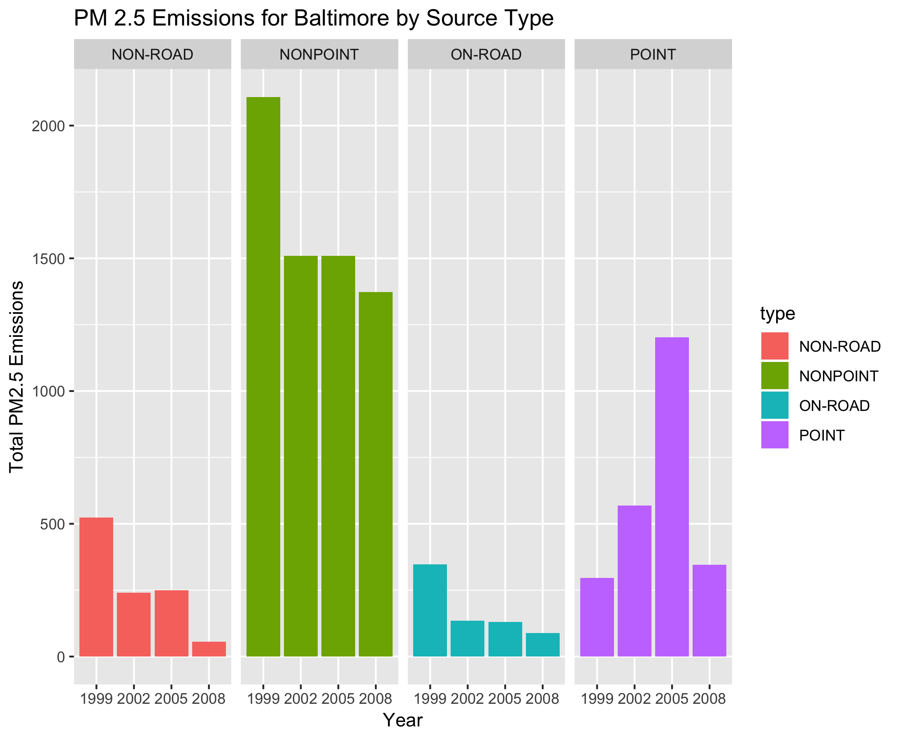
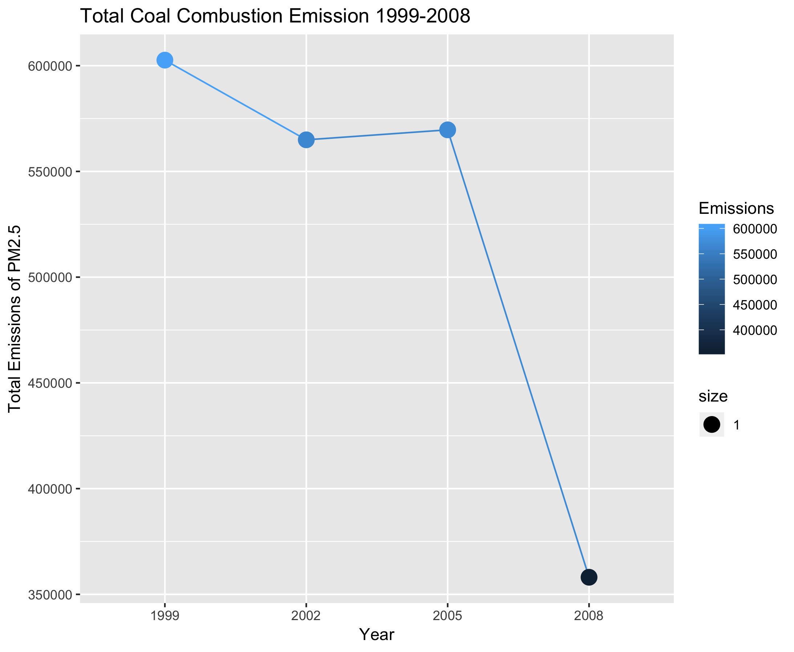
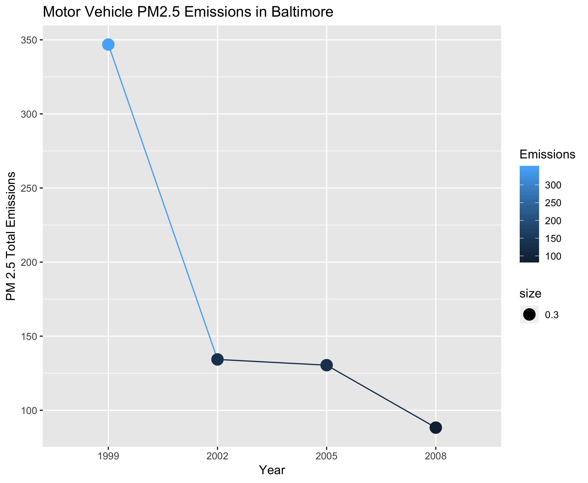
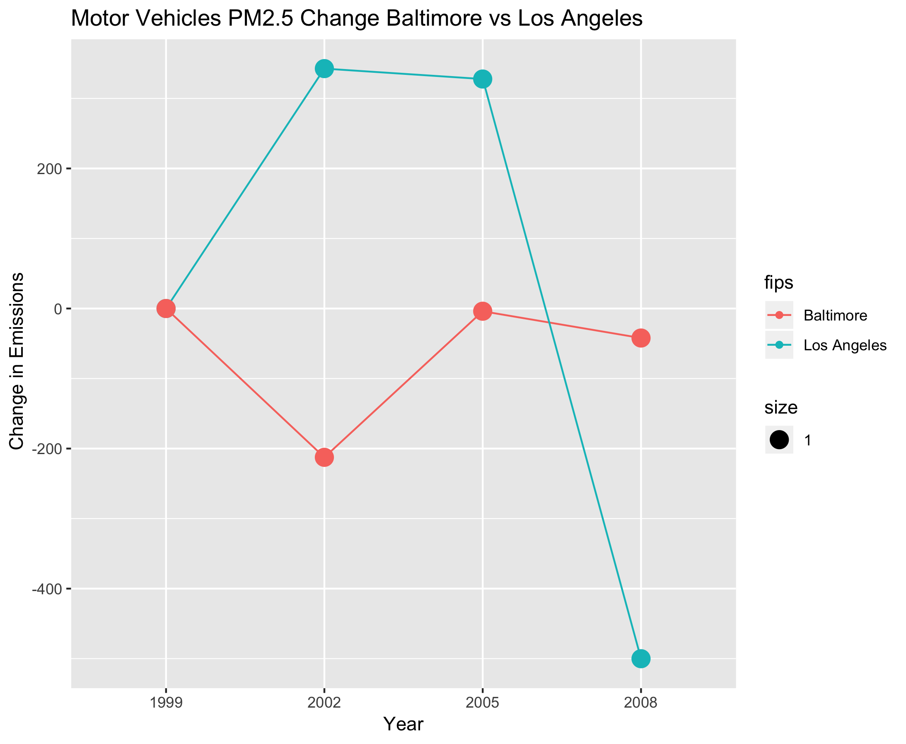

Exploratory Data Analysis - Course Project 2
================
Mayank Lavania
01-05-2019

**NOTE: My work and answers to the questions are at the bottom of this
document.**

# Introduction

Fine particulate matter (PM2.5) is an ambient air pollutant for which
there is strong evidence that it is harmful to human health. In the
United States, the Environmental Protection Agency (EPA) is tasked with
setting national ambient air quality standards for fine PM and for
tracking the emissions of this pollutant into the atmosphere.
Approximatly every 3 years, the EPA releases its database on emissions
of PM2.5. This database is known as the National Emissions Inventory
(NEI). You can read more information about the NEI at the EPA National
[Emissions Inventory web
site](http://www.epa.gov/ttn/chief/eiinformation.html).

For each year and for each type of PM source, the NEI records how many
tons of PM2.5 were emitted from that source over the course of the
entire year. The data that you will use for this assignment are for
1999, 2002, 2005, and 2008.

# Data

The data for this assignment are available from the course web site as a
single zip file:

  - [Data for Peer Assessment
    \[29Mb\]](https://d396qusza40orc.cloudfront.net/exdata%2Fdata%2FNEI_data.zip)

The zip file contains two files:

PM2.5 Emissions Data (`summarySCC_PM25.rds`): This file contains a data
frame with all of the PM2.5 emissions data for 1999, 2002, 2005, and
2008. For each year, the table contains number of tons of PM2.5 emitted
from a specific type of source for the entire year. Here are the first
few rows.

    ##     fips      SCC Pollutant Emissions  type year
    ## 4  09001 10100401  PM25-PRI    15.714 POINT 1999
    ## 8  09001 10100404  PM25-PRI   234.178 POINT 1999
    ## 12 09001 10100501  PM25-PRI     0.128 POINT 1999
    ## 16 09001 10200401  PM25-PRI     2.036 POINT 1999
    ## 20 09001 10200504  PM25-PRI     0.388 POINT 1999
    ## 24 09001 10200602  PM25-PRI     1.490 POINT 1999

  - `fips`: A five-digit number (represented as a string) indicating the
    U.S. county
  - `SCC`: The name of the source as indicated by a digit string (see
    source code classification table)
  - `Pollutant`: A string indicating the pollutant
  - `Emissions`: Amount of PM2.5 emitted, in tons
  - `type`: The type of source (point, non-point, on-road, or non-road)
  - `year`: The year of emissions recorded

Source Classification Code Table (`Source_Classification_Code.rds`):
This table provides a mapping from the SCC digit strings int he
Emissions table to the actual name of the PM2.5 source. The sources are
categorized in a few different ways from more general to more specific
and you may choose to explore whatever categories you think are most
useful. For example, source “10100101” is known as “Ext Comb /Electric
Gen /Anthracite Coal /Pulverized Coal”.

You can read each of the two files using the `readRDS()` function in R.
For example, reading in each file can be done with the following code:

    ## This first line will likely take a few seconds. Be patient!
    NEI <- readRDS("summarySCC_PM25.rds")
    SCC <- readRDS("Source_Classification_Code.rds")

as long as each of those files is in your current working directory
(check by calling `dir()` and see if those files are in the listing).

# Assignment

The overall goal of this assignment is to explore the National Emissions
Inventory database and see what it say about fine particulate matter
pollution in the United states over the 10-year period 1999–2008. You
may use any R package you want to support your analysis.

## Making and Submitting Plots

For each plot you should

  - Construct the plot and save it to a PNG file.
  - Create a separate R code file (plot1.R, plot2.R, etc.) that
    constructs the corresponding plot, i.e. code in plot1.R constructs
    the plot1.png plot. Your code file should include code for reading
    the data so that the plot can be fully reproduced. You should also
    include the code that creates the PNG file. Only include the code
    for a single plot (i.e. plot1.R should only include code for
    producing plot1.png)
  - Upload the PNG file on the Assignment submission page
  - Copy and paste the R code from the corresponding R file into the
    text box at the appropriate point in the peer assessment.

For Preparation we first ensure the data sets are available and if not
then download them. These are included in all the R files so you can run
each of them independently also to generate individual
plots.

``` r
if(!file.exists("summarySCC_PM25.rds") & !file.exists("Source_Classification_Code.rds")) {
     temp <- tempfile()
     download.file("http://d396qusza40orc.cloudfront.net/exdata%2Fdata%2FNEI_data.zip",temp)
     unzip(temp)
     unlink(temp)
}

NEI <- readRDS("summarySCC_PM25.rds") 
SCC <- readRDS("Source_Classification_Code.rds")
```

## Questions

You must address the following questions and tasks in your exploratory
analysis. For each question/task you will need to make a single plot.
Unless specified, you can use any plotting system in R to make your
plot.

## Question 1

Have total emissions from PM2.5 decreased in the United States from 1999
to 2008? Using the base plotting system, make a plot showing the total
PM2.5 emission from all sources for each of the years 1999, 2002, 2005,
and 2008.

``` r
#aggregate the emission data 

aggregate_emission <- aggregate(Emissions ~ year,NEI, sum)

#create plot
png("plot1.png", width =480, height = 480)
plot(aggregate_emission$year,(aggregate_emission$Emissions)/10^6, type ='b', xlab = "Year", ylab = "Total PM2.5 Emissions (10^6 Tons)", main="Total PM2.5 Emissions From All US Sources", col ="pink", lwd =2,xaxt = "n")
axis(side=1, at=c("1999", "2002", "2005", "2008"))
#closing the graphics
dev.off()
```



## Question 2

Have total emissions from PM2.5 decreased in the Baltimore City,
Maryland (fips==“24510”) from 1999 to 2008? Use the base plotting system
to make a plot answering this question.

``` r
#subsetting Baltimroe data
subset_baltimore <- NEI[NEI$fips == "24510",]
#aggregating Baltimore data
aggregate_baltimore <- aggregate(Emissions ~ year, subset_baltimore,sum)

#creating the plot
png("plot2.png", width =480, height = 480)
plot(aggregate_baltimore$year,(aggregate_baltimore$Emissions)/10^3, type ='b', xlab = "Year", ylab = "Total PM2.5 Emissions (10^3 Tons)", main="Total PM2.5 Emissions From Baltimore", col ="pink", lwd =2,xaxt = "n")
axis(side=1, at=c("1999", "2002", "2005", "2008"))
dev.off()
```



## Question 3

Of the four types of sources indicated by the type (point, nonpoint,
onroad, nonroad) variable, which of these four sources have seen
decreases in emissions from 1999–2008 for Baltimore City? Which have
seen increases in emissions from 1999–2008? Use the ggplot2 plotting
system to make a plot answer this question.

``` r
subset_baltimore <- NEI[NEI$fips == "24510",]

plot3 <- ggplot(data = subset_baltimore, aes(x=factor(year), y= Emissions, fill = type))+
     geom_bar(stat="identity")+
     facet_grid(cols = vars(type))+
     labs(x = "Year", y ="Total PM2.5 Emissions", title ="PM 2.5 Emissions for Baltimore by Source Type")
     
ggsave("plot3.png",plot = plot3)
dev.off()
```



## Question 4

Across the United States, how have emissions from coal
combustion-related sources changed from 1999–2008?

``` r
SCC_coal <- SCC[grepl("coal",SCC$Short.Name,ignore.case = TRUE),]
NEI_coal <- merge(NEI,SCC_coal,by = "SCC")
total_coal <- aggregate(Emissions ~ year , NEI_coal,sum)

plot4 <- ggplot(data = total_coal, aes(x=factor(year), y= Emissions))+
     geom_line(aes(group=1, col = Emissions))+
     geom_point(aes(size=1, col = Emissions))+
     labs(x="Year", y = "Total Emissions of PM2.5", title = "Total Coal Combustion Emission 1999-2008")

ggsave("plot4.png",plot = plot4)

dev.off()
```



## Question 5

How have emissions from motor vehicle sources changed from 1999–2008 in
Baltimore City?

``` r
# subset baltimore data for motor vehicles
subset_baltimore_onroad <- NEI[NEI$fips == "24510" & NEI$type == "ON-ROAD",]
aggregrate_baltimore_onroad <- aggregate(Emissions ~ year, subset_baltimore_onroad, sum)

plot5 <- ggplot(data = aggregrate_baltimore_onroad, aes(x=factor(year),y=Emissions))+
     geom_line(aes(group =1, col = Emissions))+
     geom_point(aes(size =0.3, col= Emissions))+
     labs( x= "Year", y= "PM 2.5 Total Emissions", title = "Motor Vehicle PM2.5 Emissions in Baltimore")


ggsave("plot5.png", plot = plot5)
dev.off()
```



## Question 6

Compare emissions from motor vehicle sources in Baltimore City with
emissions from motor vehicle sources in Los Angeles County, California
(fips==“06037”). Which city has seen greater changes over time in motor
vehicle emissions?

``` r
#subset data for baltimore and LA
sub_bal_los <- NEI[NEI$type == 'ON-ROAD' & (NEI$fips == '24510' | NEI$fips == '06037'),]
sub_bal_los_aggregrate <- aggregate(Emissions ~ year+fips,sub_bal_los,sum)

#calculate diff for every year
df <- sub_bal_los_aggregrate %>%
     group_by(fips) %>%
     mutate(Diff = Emissions - lag(Emissions))

#since 1998 data is not avalable we set 1999 diff to 0
df[c(1,5),4] <- 0
#assign labels to fips
df$fips <- factor(df$fips, levels = c("24510",'06037'), labels = c("Baltimore", "Los Angeles"))

plot6 <- ggplot(data = df, aes(x=factor(year), y = Diff , group = fips, color = fips))+
     geom_line()+
     geom_point(aes(size=1))+
     labs(x= "Year", y= " Change in Emissions", title = "Motor Vehicles PM2.5 Change Baltimore vs Los Angeles")

ggsave("plot6.png", plot = plot6)

dev.off()
```

Clearly LA has higher change rate compared to Baltimore year on year


